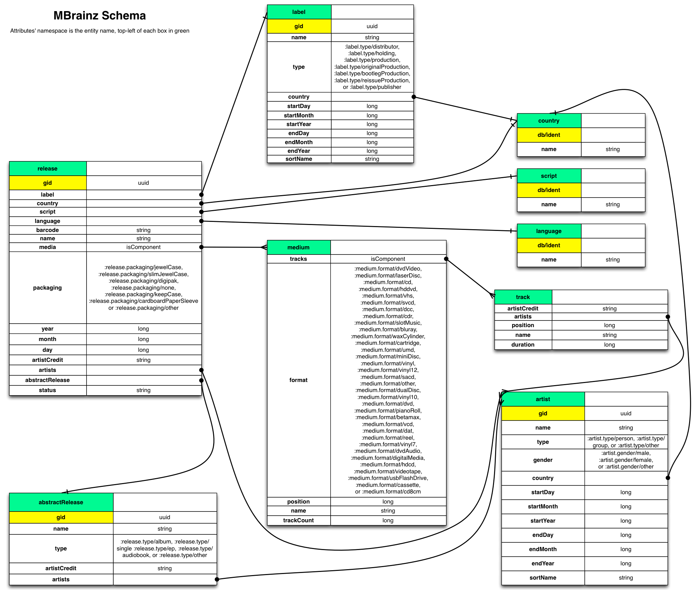

# MusicBrainz on Datomic

[Datomic](http://datomic.com) is a database of flexible, time-based
facts, supporting queries and joins with elastic scalability, and ACID
transactions.

[MusicBrainz](http://musicbrainz.org) is an open music encyclopedia
that collects music metadata and makes it available to the public.
This sample project uses the MusicBrainz dataset, but is in no way
affiliated with or sponsored by MusicBrainz.

The MusicBrainz dataset makes a great example database for learning,
evaluating, or testing Datomic.  For this sample database, we have
exported the MusicBrainz distribution database as EDN data files,
imported that data into Datomic according to the Schema described
below, and [backed up](http://docs.datomic.com/backup.html) that
database.

Included in this project are:

* Instructions for downloading and restoring the Datomic backup to your local transactor
* Datomic Datalog rules to be composed together to create interesting queries
* Some sample queries as a starting point

## Getting Started

You need to do two things to use this sample: get the sample code and
get the Datomic backup containing the mbrainz data.

### Getting the Code

Clone the git repo somewhere convenient:

    git clone git@github.com:Datomic/mbrainz-sample.git
    cd mbrainz-sample

## Getting the Data

First download a
[Datomic distribution](http://www.datomic.com/get-datomic.html), and
unzip it somewhere convenient:

    wget http://downloads.datomic.com/0.8.3862/datomic-free-$VERSION.zip
    unzip datomic-free-$VERSION.zip

Then, start the transactor (using a large enough heap):

    cd datomic-free-$VERSION
    bin/transactor -Xmx2g config/samples/free-transactor-template.properties

Next, in a new shell, download the
[mbrainz backup](http://s3.amazonaws.com/mbrainz/20130510-backup.zip):

    # 2.85 GB
    wget http://s3.amazonaws.com/mbrainz/20130510-backup.zip

and unzip:

    # this takes a while
    unzip 20130510-backup.zip

Finally, [restore the backup](http://docs.datomic.com/backup.html):

    # takes a while, but prints progress
    bin/datomic restore-db file:20130510-backup datomic:free://localhost:4334/mbrainz

Now you're ready to fire up a REPL and evaluate the forms in
`src/datomic/samples/mbrainz.clj` one at a time.

## Schema

This schema is an adaptation of a subset of the full
[MusicBrainz schema](http://musicbrainz.org/doc/MusicBrainz_Database/Schema).
We didn't include some entities, and we made some simplifying
assumptions and combined some entities.  In particular:

* We omit any notion of [Work](http://musicbrainz.org/doc/Work)
* We combine Track, Tracklist and [Recording](http://musicbrainz.org/doc/Recording) into simply "track"
* We de-normalize to use :db.cardinality/many where appropriate
* We renamed [Release group](http://musicbrainz.org/doc/Release_Group) to "abstractRelease"

### Abstract Release vs. Release

(Adapted from the MusicBrainz [schema docs](http://musicbrainz.org/doc/MusicBrainz_Database/Schema))

An "abstractRelease" is an abstract "album" entity (e.g. "The Wall" by
Pink Floyd).  A "release" is something you can buy in your music store
(e.g. the 1984 US vinyl release of "The Wall" by Columbia, as opposed
to the 2000 US CD release by Capitol Records).

### Diagram

## License

Copyright © Metadata Partners, LLC. All rights reserved.

Distributed under the Eclipse Public License, the same as Clojure.
