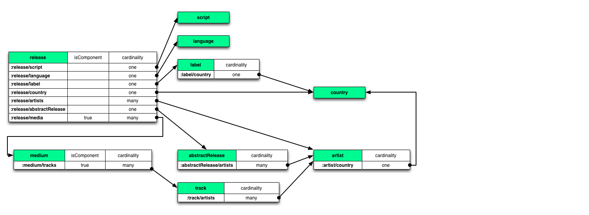

# Datomic MusicBrainz sample database

[Datomic](http://datomic.com) is a database of flexible, time-based
facts, supporting queries and joins with elastic scalability, and ACID
transactions.

[MusicBrainz](http://musicbrainz.org) is an open music encyclopedia
that collects music metadata and makes it available to the public.
This sample project uses the MusicBrainz dataset, but is in no way
affiliated with or sponsored by MusicBrainz.

The MusicBrainz dataset makes a great example database for learning,
evaluating, or testing Datomic.  To create this sample database, we have
exported the MusicBrainz distribution database as EDN data files,
imported that data into Datomic according to the Schema described
below, and [backed up](http://docs.datomic.com/backup.html) that
database.

Included in this project are:

* Instructions for downloading and restoring the Datomic backup to your local transactor
* Datomic Datalog rules to be composed together to create interesting queries
* Some sample queries as a starting point

## Getting Started

### Getting Datomic

First download a
[Datomic distribution](http://www.datomic.com/get-datomic.html) and
unzip it somewhere convenient:

    wget http://downloads.datomic.com/$VERSION/datomic-free-$VERSION.zip
    unzip datomic-free-$VERSION.zip

For this walk-through, we'll use
[Datomic Free](http://downloads.datomic.com/free.html) and local
storage, but you could use
[Datomic Pro](http://downloads.datomic.com/pro.html) with any of the
available [storage options](http://docs.datomic.com/storage.html) by
uncommenting the Pro dependency in [project.clj](project.clj).

Then, start the transactor:

    cd datomic-free-$VERSION
    bin/transactor config/samples/free-transactor-template.properties

### Getting the Data

Next download the
[mbrainz backup](http://s3.amazonaws.com/mbrainz/datomic-mbrainz-backup-20130611.tar):

    # in a new shell (or just click the link above)
    # 2.8 GB, md5 8bf4e1e3f459a94bc06505fbe5f31ef3
    wget http://s3.amazonaws.com/mbrainz/datomic-mbrainz-backup-20130611.tar

and extract:

    # this takes a while
    tar -xvf datomic-mbrainz-backup-20130611.tar

Finally, [restore the backup](http://docs.datomic.com/backup.html):

    # takes a while, but prints progress -- ~150,000 segments in restore
    bin/datomic restore-db file:/full/path/to/datomic-mbrainz-backup-20130611 datomic:free://localhost:4334/mbrainz

### Getting the Code

Clone this git repo somewhere convenient:

    git clone git@github.com:Datomic/mbrainz-sample.git
    cd mbrainz-sample

### Running the examples

#### From Java

Fire up your favorite IDE, and configure it to use both the included
[pom.xml](./pom.xml) and the following Java options when running:

    -Xmx2g -server

Then visit the
[queries](//github.com/Datomic/mbrainz-sample/wiki/Queries) page.

#### From Clojure

Start up a Clojure REPL:

    # from the root of this mbrainz-sample repo
    lein repl

Then
[connect to the database and run the queries](//github.com/Datomic/mbrainz-sample/wiki/Queries).

## Schema

Here is a diagram of the relationships:

For information about the schema in general, or about individual
entities and their attributes, please see the
[schema](//github.com/Datomic/mbrainz-sample/wiki/Schema) page in the
wiki, or the [EDN schema](schema.edn) itself.

## Example Queries and Rules

Please see the
[queries](//github.com/Datomic/mbrainz-sample/wiki/Queries) page in
the wiki.

## Thanks

We would like to thank the MusicBrainz project for defining and
compiling a great dataset, and for making it freely available.

## License

Copyright © Metadata Partners, LLC. All rights reserved.

Distributed under the Eclipse Public License, the same as Clojure.
