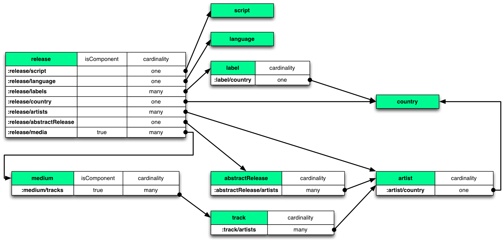

# Datomic MusicBrainz sample database

[Datomic](http://datomic.com) is a database of flexible, time-based
facts, supporting queries and joins with elastic scalability, and ACID
transactions.

[MusicBrainz](http://musicbrainz.org) is an open music encyclopedia
that collects music metadata and makes it available to the public.
This sample project uses the MusicBrainz dataset, but is in no way
affiliated with or sponsored by MusicBrainz.

The MusicBrainz dataset makes a great example database for learning,
evaluating, or testing Datomic.  To create this sample database, we have
exported the MusicBrainz distribution database as EDN data files,
imported that data into Datomic according to the Schema described
below, and [backed up](http://docs.datomic.com/on-prem/backup.html) that
database.

Included in this project are:

* Instructions for downloading and restoring the Datomic backup to your local transactor
* Datomic Datalog rules to be composed together to create interesting queries
* Some sample queries as a starting point

## Getting Started

### Getting Datomic

Follow the directs in https://docs.datomic.com/pro/releases.html to download 
Datomic Pro and unzip it somewhere convenient.

After unzipping, install the `datomic` dependency to your local maven repository:

```shell
cd datomic-pro-$VERSION
bin/maven-install
```

The above requires the `mvn` binary installed locally (available from Homebrew via `brew install mvn`).

Start the transactor:

    cd datomic-pro-$VERSION
    bin/transactor config/samples/dev-transactor-template.properties

### Getting the Data

Next download the
[subset of the mbrainz database](https://s3.amazonaws.com/mbrainz/datomic-mbrainz-1968-1973-backup-2017-07-20.tar)
covering the period 1968-1973 (which the Datomic team has
scientifically determined as being the most important period in the
history of recorded music):

    wget https://s3.amazonaws.com/mbrainz/datomic-mbrainz-1968-1973-backup-2017-07-20.tar -O mbrainz.tar
    tar -xvf mbrainz.tar

From the `datomic-pro-$VERSION` directory, [restore the backup](http://docs.datomic.com/on-prem/operation/backup.html#restoring):

    # prints progress -- ~1,000 segments in restore
    bin/datomic restore-db file://path/to/backup/mbrainz-1968-1973 datomic:dev://localhost:4334/mbrainz-1968-1973

### Getting the Code

Clone this git repo somewhere convenient:

    git clone git@github.com:Datomic/mbrainz-sample.git
    cd mbrainz-sample

### Running the examples

#### From Java

Fire up your favorite IDE, and configure it to use both the included
[pom.xml](./pom.xml) and the following Java options when running:

    -Xmx2g -server

Then visit the [queries](//github.com/Datomic/mbrainz-sample/wiki/Queries) page.

#### From Clojure

Start up a Clojure REPL:

    # from the root of this mbrainz-sample repo
    lein repl

Then [connect to the database and run the queries](//github.com/Datomic/mbrainz-sample/wiki/Queries).

## Schema

Here is a diagram of the relationships:



For information about the schema in general, or about individual
entities and their attributes, please see the
[schema](//github.com/Datomic/mbrainz-sample/wiki/Schema) page in the
wiki, or the [EDN schema](schema.edn) itself.

## Example Queries and Rules

Please see the [queries](//github.com/Datomic/mbrainz-sample/wiki/Queries) page in the wiki.

## Thanks

We would like to thank the MusicBrainz project for defining and
compiling a great dataset, and for making it freely available.

## Contributing

This tutorial is developed internally by Cognitect. Issues can be filed using
[Github Issues](https://github.com/Datomic/mbrainz-sample/issues). We do
not accept pull request or patches.

## License

Copyright © Metadata Partners, LLC. All rights reserved.

Distributed under the Eclipse Public License, the same as Clojure.
